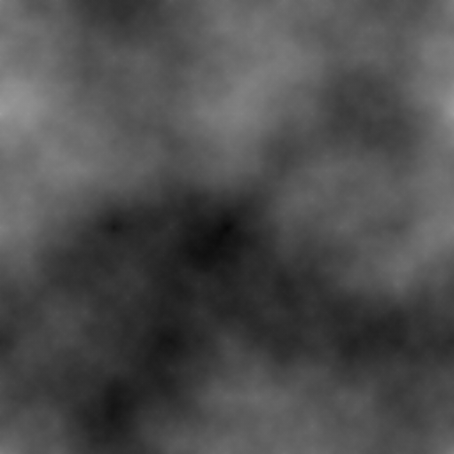

# Diamond-square algorithm

The
[Diamond-square algorithm](https://en.wikipedia.org/wiki/Diamond-square_algorithm)
generates heightfields using randomised midpoint displacement.



This code is a header-only, C++11 implementation of the diamond-square algorithm
as first put forward by Fournier, Fussell and Carpenter in "Computer rendering
of stochastic models" in 1982. The code provides tileable and non-tileable
versions of the algorithm.

## Integration

The single header file, `diamond_square.hpp` is in the `src` directory.
Integration is simply including the header,

```c++
#include "diamond_square.hpp"
```

in the relevant files. C++11 or later must be enabled (e.g., `-std=c++11`,
`-std=c++14` for GCC and Clang).

## Example

An example use can be found in main.cpp, which outputs the generated
non-tileable heightfield in
[PGM format](https://netpbm.sourceforge.net/doc/pgm.html) to the terminal:

```c++
#include <chrono>
#include <cmath>
#include <cstdint>
#include <cstdlib>
#include <iostream>
#include <random>
#include "diamond_square.hpp"

int main()
{
    auto seed = std::chrono::system_clock::now().time_since_epoch().count();

    std::default_random_engine engine{seed};
    std::uniform_real_distribution<float> distribution{0, 1};

    constexpr auto size = 513;
    constexpr auto edge = size - 1;

    uint8_t map[size][size] = {{0}};
    map[0][0] = map[edge][0] = map[0][edge] = map[edge][edge] = 128;

    heightfield::diamond_square_no_wrap(
        size,
        // random
        [&engine, &distribution](float range)
        {
            return distribution(engine) * range;
        },
        // variance
        [](int level) -> float
        {
            return 64.0f * std::pow(0.5f, level);
        },
        // at
        [&map](int x, int y) -> uint8_t&
        {
            return map[y][x];
        }
    );

    // Output PGM (Netpbm greyscale image format)
    std::cout << "P2 " << size << ' ' << size << " 255\n";

    for (auto& row : map) {
        for (auto& cell : row) {
            std::cout << (int)cell << '\n';
        }
    }

    return EXIT_SUCCESS;
}
```

The output can be opened by most viewers but it is also possible to use the
following to easily produce, for example, a PNG:

```
./diamond-square | convert - out.png
```

## Reference

This reference text is available as comments in the source code.

### diamond_square_no_wrap

The function takes the following parameters:

- **size**. Size of the desired heightfield. Valid values are powers of two plus
one (i.e., 2<sup>n</sup> + 1), such as 129, 257 and 513. Must be at least five.
Invalid sizes will trigger an assertion failure.

- **random**. A callback of the form `float(float limit)` that returns a random
value ranging from 0 (inclusive) to limit (exclusive). This function is called
once for each heightfield location excluding the corner points (i.e.,
size<sup>2</sup> - 4 times).

- **variance**. A callback of the form `float(int level)` that returns the
maximum variance in one direction for the specified level. The level starts from
zero and increases for each recursion. For example, a heightfield of size 129
has seven levels, zero through six. Generally speaking, the variance halves each
iteration. A good start is `constant * pow(0.5f, level)`. This function is
called once for each level.

- **at**. A callback of the form `U(int x, int y)` that returns a mutable
reference to the heightfield location specified by the coordinates. A coordinate
will range from zero (inclusive) to size (exclusive). The return type U can be
any numeric type but it must be, or act as, a non-const reference to allow the
algorithm to output its results. This allows the user to decide how the
heightfield is stored in memory.

The corner points of the heightfield should be initialised to suitable
starting values before calling this function.

The resulting heightfield is not tileable. Points along the edges are
averaged over three neighbouring points instead of the usual four.

Variance is defined in one direction but is applied in both. If we assume an
integer type for the heightfield and an initial value of 128, then a variance
of 100 will result in a range of 28 to 228.

No clamping is performed by this algorithm so if the randomness, variance and
initial values combine to generate a value smaller or larger than the data
type referenced by `at`, underflow or overflow can occur.

The time complexity of this algorithm is O(n<sup>2</sup>) where n is `size`.
The space complexity is constant (and small) as this algorithm makes no
allocations internally, relying on the user to provide the data structure and
accessing it via `at`.

### diamond_square_wrap

The function takes the following parameters:

- **size**. Size of the desired heightfield. Valid values are powers of two
(i.e., 2<sup>n</sup>), such as 128, 256 and 512. Must be at least four. Invalid
sizes will trigger an assertion failure.

- **random**. A callback of the form `float(float limit)` that returns a random
value ranging from 0 (inclusive) to limit (exclusive). This function is called
once for each heightfield location excluding the initial top left point (i.e.,
size<sup>2</sup> - 1 times).

- **variance**. A callback of the form `float(int level)` that returns the
maximum variance in one direction for the specified level. The level starts from
zero and increases for each recursion. For example, a heightfield of size 128
has seven levels, zero through six. Generally speaking, the variance halves each
iteration. A good start is `constant * pow(0.5f, level)`. This function is
called once for each level.

- **at**. A callback of the form `U(int x, int y)` that returns a mutable
reference to the heightfield location specified by the coordinates. A coordinate
will range from zero (inclusive) to size (exclusive). The return type U can be
any numeric type but it must be, or act as, a non-const reference to allow the
algorithm to output its results. This allows the user to decide how the
heightfield is stored in memory.

The top left point of the heightfield should be initialised to a suitable
starting value before calling this function.

The resulting heightfield is tileable.

Variance is defined in one direction but is applied in both. If we assume an
integer type for the heightfield and an initial value of 128, then a variance
of 100 will result in a range of 28 to 228.

No clamping is performed by this algorithm so if the randomness, variance
and initial values combine to generate a value smaller or larger than the
data type referenced by `at`, underflow or overflow can occur.

The time complexity of this algorithm is O(n<sup>2</sup>) where n is `size`.
The space complexity is constant (and small) as this algorithm makes no
allocations internally, relying on the user to provide the data structure and
accessing it via `at`.

## Licence


Licensed under the [MIT Licence](https://opensource.org/licenses/MIT):

Copyright &copy; 2018 [Martyn Afford](https://mafford.com)

Permission is hereby granted, free of charge, to any person obtaining a copy of
this software and associated documentation files (the "Software"), to deal in
the Software without restriction, including without limitation the rights to
use, copy, modify, merge, publish, distribute, sublicense, and/or sell copies of
the Software, and to permit persons to whom the Software is furnished to do so,
subject to the following conditions:

The above copyright notice and this permission notice shall be included in all
copies or substantial portions of the Software.

THE SOFTWARE IS PROVIDED "AS IS", WITHOUT WARRANTY OF ANY KIND, EXPRESS OR
IMPLIED, INCLUDING BUT NOT LIMITED TO THE WARRANTIES OF MERCHANTABILITY,
FITNESS FOR A PARTICULAR PURPOSE AND NONINFRINGEMENT. IN NO EVENT SHALL THE
AUTHORS OR COPYRIGHT HOLDERS BE LIABLE FOR ANY CLAIM, DAMAGES OR OTHER
LIABILITY, WHETHER IN AN ACTION OF CONTRACT, TORT OR OTHERWISE, ARISING FROM,
OUT OF OR IN CONNECTION WITH THE SOFTWARE OR THE USE OR OTHER DEALINGS IN THE
SOFTWARE.
